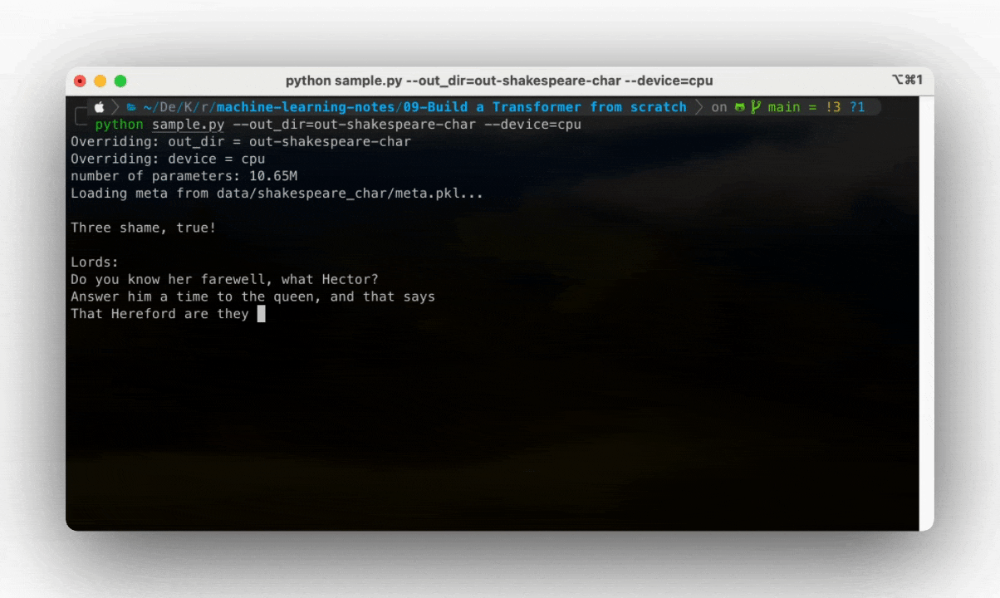

# How to run NanoGPT

# NanoGPT on "Shakespeare" dataset
I followed the instructions on the [NanoGPT](https://github.com/karpathy/nanoGPT) repository. It's just that I performed the experiment on my school's compute cluster. I did the following:

1. Acquired an interactive compute node using the following command:

```sh
srun -N1 -G1 -c4 --mem=100G --container-remap-root --no-container-entrypoint --container-image /work/group/humingamelab/sqsh_images/pytorch.sqsh --container-mounts="${HOME}"/machine-learning-notes:/workdir --container-workdir /workdir --pty bash -i
```

2. Install all the necessary packages, and ran the training pipeline by running the following script

```sh
./train-shakespeare.sh
```

After the above, I was able to get some output by running:

```sh
python sample.py --out_dir=out-shakespeare-char --device=cpu
```



```txt
ANGELO:
Ay, but a while we see a serious business?

ESCALUS:
Take the happiness.

ISABELLA:
It is enough, my lord, and how the other to the heart
may not pluck misters. I hear them in the sea,
Let not him be about like to ease the market-blow:
And is't not falls of the foot?

DUKE VINCENTIO:
Not a letter of your prince to the profit
And him from London of Hereford Anne, the son; which must not have
A thousand of gross cordship of strength:
Sadness he hath not in the cause of Rutland,
And for hi
---------------
```
The output does not make sense but, looks legit 😆🤷🏾‍♂️. I am happy I was able to reproduce the results.

# NanoGPT on openwebtext

Here also, I followed instructions on the [NanoGPT](https://github.com/karpathy/nanoGPT), but performed the experiment on the school's compute cluster.

~IN PROGRESS~
1. I first put together a `.sbatch` file to describe the training job I want
2. Submitted the job for execution.